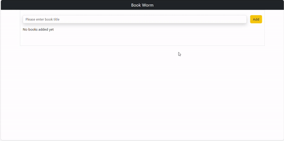

# Book Worm

Library software offering features for book deletion, editing, and monitoring their reading status.

## Available Scripts

### `npm start`: 

Runs the app in development mode. Open http://localhost:3000 to view it in your browser.

### `npm test`: 

Launches the test runner in interactive watch mode.

### `npm run build`: 

Builds the app for production to the build folder. Your app is ready to be deployed!

### `npm run eject`: 

Note that this is a one-way operation.

### Learn More

You can learn more in the Create React App documentation.

To learn React, check out the React documentation.

### Deployment

See the section about deployment for more information.

### Used Technologies

HTML, Css, JavaScript, React JS

